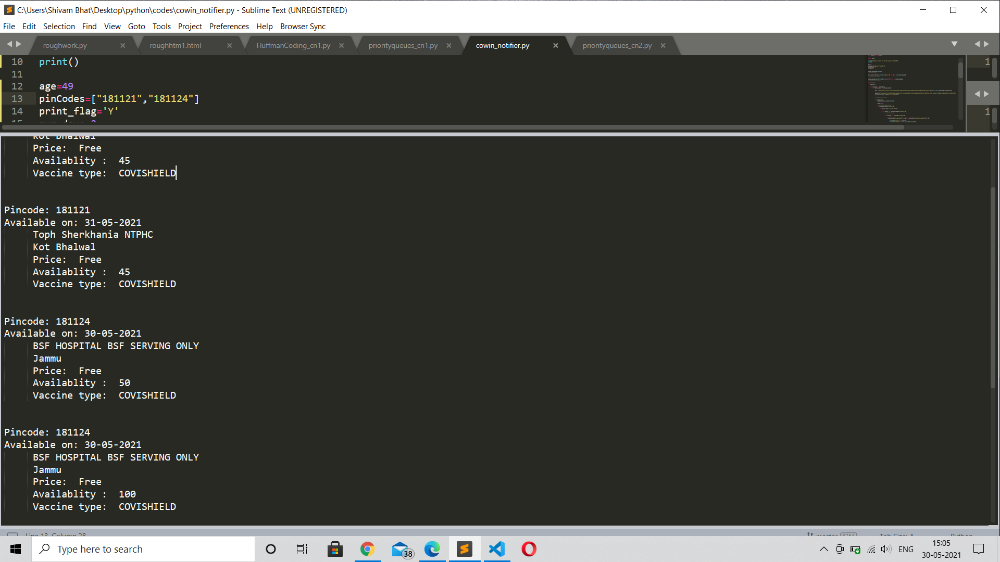

# Cowin_Slots
 It helps you find the vaccine slots on the basis of Pin Code and age

This Python Program can help you to find the slots based on your PIN Code and age to find the vaccine slots  and it will continue to search after every 2 min until you terminate it on your own. You can Even Modify it to search on the basis of District.

How to Run It?

Just Follow Instructions from the requirements.txt and run it. 

## License & Copyright
© Shivam Bhat, YMCA Faridabad
